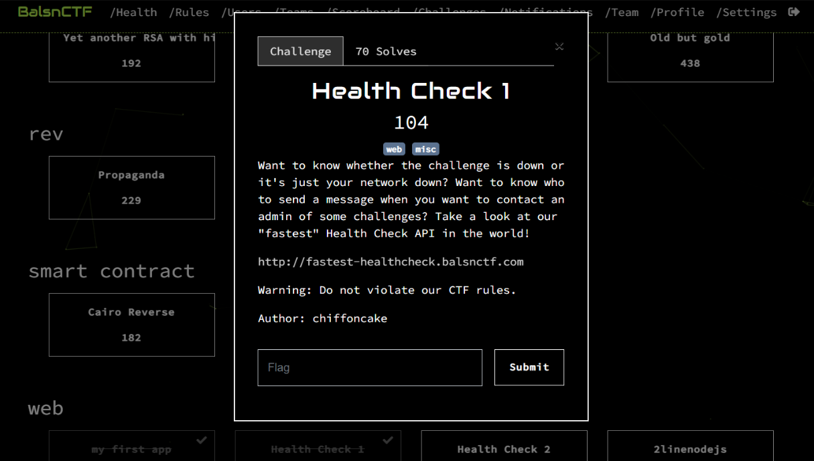

# BALSN CTF Writeup

BALSN CTF took place from 3rd September to 5th September (04:00 a.m.). Two of us spent some time of our weekend on the CTF that was prepared by a CTF team from the Network Security Lab of National Taiwan University. Apart from the welcome challenge, we solved two web challenges, namely `my first app` and `Health Check 1`.

## Challenges Solved

- **`my first app`**  
  This was a web app based on Next.js. The challenge consisted of understanding how Next.js rendering works and that it partly happens client-side. The client-side rendering included part of an imported dictionary variable that also contained the flag. Even though the flag was not part of the rendered HTML output, in order to render the HTML using part of the mentioned variable, the whole variable, including the flag, was sent to the client somewhere in a bulk of responses.

- **`Health Check 1`**  
  This required finding a `/docs` directory, which contained documentation of a FastAPI implementation. This allowed uploading an executable which would be run. Also, a way of retrieving output of executed commands was provided by the API. One could use this to create a reverse shell. The flag itself was in a `./flag1.py` script; however, the user running the executable did not have read permission (nor any other). The solution was to read the flag from the compiled Python script in the `__pycache__` folder. I managed to solve this one at 3:32 a.m., 27 minutes before CTF end 😅.

## Results

Overall, even though we only had two people spend some of their weekend on the challenges, we placed **97th out of 584** actively participating teams.

